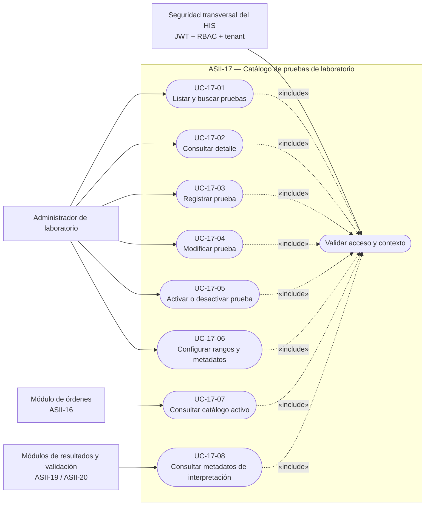
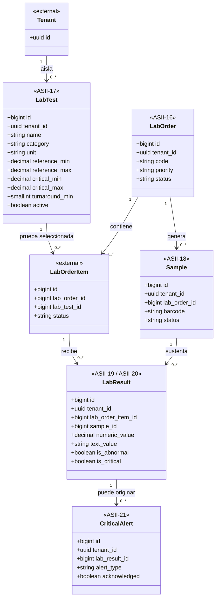

# ASII-17 — Catálogo de pruebas de laboratorio

## Actividad de la semana 1: UML y narrativa de alcance

| Dato | Valor |
|---|---|
| Estudiante | JOSUÉ MANUEL MARTÍNEZ PEDROZA |
| GitHub | `Josuemart555` |
| Módulo | ASII-17 — Catálogo de pruebas de laboratorio |
| Issue | [#31 — ASII-17 — Catálogo de pruebas de laboratorio](https://github.com/compilations-teams/sistema-hospitalario-integrado-SistenasII-2026/issues/31) |
| Rama | `feature/asii-17-catalogo-pruebas-laboratorio-josuemart555` |
| Entrega | Semana 1 — diagrama UML de casos de uso y narrativa breve |

## 1. Objetivo

Delimitar el comportamiento del catálogo de pruebas de laboratorio dentro del Sistema Hospitalario Integrado (HIS), identificar sus actores y documentar cómo será consumido por los módulos de órdenes, resultados, validación y alertas críticas.

Esta entrega es exclusivamente de análisis y diseño. No agrega rutas, controladores, modelos, migraciones, componentes Vue ni comportamiento ejecutable.

## 2. Fuentes analizadas

- `README.md`: asignación del módulo y entregable esperado para la semana 1.
- `docs/weekly-plan.md`: actividad de conceptos generales, orientación a objetos y UML.
- `database/migrations/2026_04_26_130000_create_laboratory_tables.php`: estructura scaffold de `lab_tests` y sus relaciones.
- `app/Models/LabOrder.php` y `app/Models/LabResult.php`: límites actuales del dominio de laboratorio.

El scaffold existente se toma como punto de partida y no como funcionalidad terminada. Actualmente no existen endpoints clínicos ni interfaz del catálogo.

## 3. Límite del módulo

### Incluido en ASII-17

- Consultar, buscar y filtrar el catálogo.
- Consultar el detalle de una prueba.
- Registrar y modificar pruebas de laboratorio.
- Definir categoría, unidad de medida y tiempo estimado de respuesta.
- Definir rangos normales y límites críticos.
- Activar o desactivar pruebas sin eliminar sus referencias históricas.
- Exponer la información del catálogo a consumidores autorizados del mismo tenant.

### Fuera de alcance

- Crear órdenes desde el expediente médico: módulo ASII-16.
- Recibir y etiquetar muestras: módulo ASII-18.
- Ingresar resultados: módulo ASII-19.
- Validar resultados: módulo ASII-20.
- Generar y entregar alertas críticas: módulo ASII-21.
- Administrar usuarios, roles, permisos o tenants: módulos transversales ASII-01 y ASII-02.

Los elementos fuera de alcance aparecen únicamente como actores o entidades externas para representar la integración.

## 4. Actores

| Actor | Tipo | Responsabilidad respecto al catálogo |
|---|---|---|
| Administrador de laboratorio | Humano, principal | Mantiene las pruebas, unidades, rangos y estado del catálogo. |
| Módulo de órdenes de laboratorio | Sistema externo, consumidor | Consulta pruebas activas para agregarlas a una orden. |
| Módulo de resultados y validación | Sistema externo, consumidor | Consulta unidad, rangos normales y límites críticos. |
| Seguridad transversal del HIS | Sistema de soporte | Verifica JWT, permiso RBAC y tenant antes de permitir una operación. |

## 5. Diagrama UML de casos de uso

## 6. Narrativa de casos de uso

| Código | Caso de uso | Actor principal | Resultado esperado |
|---|---|---|---|
| UC-17-01 | Listar y buscar pruebas | Administrador de laboratorio | Obtiene únicamente pruebas del tenant actual, con filtros por nombre, categoría y estado. |
| UC-17-02 | Consultar detalle | Administrador de laboratorio | Visualiza información descriptiva, unidad, rangos, tiempo estimado y estado. |
| UC-17-03 | Registrar prueba | Administrador de laboratorio | Crea una prueba única por nombre dentro del tenant autenticado. |
| UC-17-04 | Modificar prueba | Administrador de laboratorio | Actualiza datos permitidos sin cambiar el tenant ni romper referencias históricas. |
| UC-17-05 | Activar o desactivar prueba | Administrador de laboratorio | Controla su disponibilidad para nuevas órdenes sin eliminarla físicamente. |
| UC-17-06 | Configurar rangos y metadatos | Administrador de laboratorio | Define categoría, unidad, rangos normales, límites críticos y tiempo estimado. |
| UC-17-07 | Consultar catálogo activo | Módulo de órdenes | Recibe pruebas activas del mismo tenant para seleccionar una o varias en una orden. |
| UC-17-08 | Consultar metadatos de interpretación | Módulos de resultados y validación | Obtiene unidad y rangos asociados a la prueba ordenada. |

## 7. Especificación del flujo principal

### Administración del catálogo

#### Precondiciones

1. El usuario posee un JWT válido.
2. La solicitud tiene un tenant válido identificado por el mecanismo transversal del HIS.
3. El usuario tiene el permiso requerido para administrar el catálogo.

#### Flujo principal

1. El administrador abre el catálogo de pruebas.
2. El sistema valida identidad, permiso y contexto de tenant.
3. El sistema presenta las pruebas pertenecientes al tenant actual.
4. El administrador registra una prueba o selecciona una existente para modificarla.
5. Ingresa o actualiza nombre, categoría, unidad, rangos, límites críticos y tiempo estimado.
6. El sistema valida obligatoriedad, formatos, coherencia de rangos y unicidad.
7. El sistema guarda la información asociada al tenant actual.
8. Si la prueba está activa, queda disponible para nuevas órdenes del mismo tenant.

#### Postcondiciones

- La prueba queda registrada o actualizada dentro del tenant autenticado.
- Las referencias de órdenes anteriores se conservan.
- Ningún dato de otro tenant es consultado o modificado.

### Consulta desde una orden

1. El módulo ASII-16 solicita las pruebas activas para el tenant actual.
2. El catálogo valida el contexto y devuelve solo pruebas activas del mismo tenant.
3. La orden conserva la referencia a la prueba seleccionada mediante `lab_test_id`.
4. El módulo ASII-17 no crea ni modifica la orden.

## 8. Flujos alternos y excepciones

| Condición | Respuesta esperada |
|---|---|
| JWT ausente, inválido o vencido | Rechazar la operación como no autenticada. |
| Usuario sin permiso | Rechazar la operación como no autorizada. |
| Tenant ausente o inválido | Rechazar la solicitud sin usar un tenant indicado por el cuerpo de la petición. |
| Nombre duplicado dentro del tenant | Rechazar el registro o actualización e informar el conflicto. |
| Rango mínimo mayor que el máximo | Rechazar los valores incoherentes. |
| Límite crítico incompatible con el rango definido | Rechazar o solicitar corrección según la regla formal que se acuerde en semana 2. |
| Prueba desactivada | Ocultarla de nuevas órdenes, pero permitir la consulta histórica autorizada. |
| Intento de acceso a una prueba de otro tenant | Responder como recurso no disponible y no revelar su existencia. |

## 9. Reglas de dominio identificadas

| Regla | Descripción |
|---|---|
| RN-17-01 | El nombre de una prueba es único dentro de un tenant, según la restricción `uq_lab_tests_tenant_name`. |
| RN-17-02 | Toda consulta y modificación debe quedar limitada al tenant autenticado. |
| RN-17-03 | Solo las pruebas activas pueden seleccionarse en nuevas órdenes. |
| RN-17-04 | Desactivar una prueba no elimina las asociaciones existentes con órdenes o resultados. |
| RN-17-05 | Si existen ambos extremos de un rango, el mínimo no puede superar al máximo. |
| RN-17-06 | Los límites críticos se utilizan como metadatos para determinar resultados potencialmente críticos; la alerta pertenece a ASII-21. |
| RN-17-07 | La categoría y la unidad pueden ser opcionales conforme al scaffold, pero su obligatoriedad funcional deberá formalizarse en semana 2. |
| RN-17-08 | El tiempo estimado se expresa en minutos y, cuando exista, debe ser un entero positivo. |

## 10. Diagrama UML conceptual del dominio

Este diagrama sirve como mapa de integración. Solo `LabTest` pertenece al alcance funcional de ASII-17; las demás clases son referencias externas existentes o planificadas.

## 11. Matriz de integración

| Módulo relacionado | Dato utilizado | Dirección | Responsabilidad de ASII-17 |
|---|---|---|---|
| ASII-01 / ASII-02 | Tenant, identidad y permisos | Entrada transversal | Exigir contexto autenticado; no administrar seguridad. |
| ASII-16 — Órdenes | Prueba activa y `lab_test_id` | Catálogo → órdenes | Proporcionar pruebas seleccionables. |
| ASII-18 — Muestras | Relación indirecta mediante la orden | Solo referencia | Ninguna operación sobre muestras. |
| ASII-19 — Resultados | Unidad y rangos | Catálogo → resultados | Proporcionar metadatos para interpretar el valor. |
| ASII-20 — Validación | Rangos normales y críticos | Catálogo → validación | Mantener los límites; no validar resultados. |
| ASII-21 — Alertas | Límite crítico, de forma indirecta | Catálogo → resultado → alerta | Definir el límite; no emitir ni reconocer alertas. |

## 12. Decisiones y riesgos

- **Decisión:** modelar desactivación en lugar de borrado para proteger el historial clínico.
- **Decisión:** representar los módulos vecinos como consumidores, sin introducir cambios en sus modelos o flujos.
- **Decisión:** tratar `tenant_id` como contexto derivado de autenticación, no como un identificador confiable enviado por el usuario.
- **Riesgo:** todavía no está definido el permiso RBAC definitivo del catálogo; se documentará junto al contrato API.
- **Riesgo:** la interpretación de límites críticos necesita una regla funcional acordada para valores faltantes o resultados textuales.
- **Riesgo:** cambiar rangos de una prueba puede afectar la interpretación histórica; en diseño posterior deberá decidirse si se conserva una instantánea por orden o resultado.

## 13. Criterios de aceptación de la actividad

- [x] Se identifica el actor principal y los sistemas consumidores.
- [x] Se delimita qué pertenece y qué no pertenece al módulo ASII-17.
- [x] Se documentan los casos de uso del catálogo.
- [x] Se incluye una narrativa con precondiciones, flujo principal, alternativas y postcondiciones.
- [x] Se consideran autenticación, autorización RBAC y aislamiento por tenant.
- [x] Se representan las conexiones con módulos vecinos sin modificar su código.
- [x] Se documentan decisiones, riesgos e incertidumbres para las siguientes semanas.

## 14. Validación aplicable

Al ser una entrega exclusivamente documental, no requiere ejecutar migraciones, pruebas PHP ni build de frontend. La validación consiste en:

1. comprobar la estructura del Markdown;
2. validar la sintaxis de los dos bloques Mermaid;
3. confirmar que el diff solo contiene documentación del módulo ASII-17;
4. confirmar que la rama parte de `origin/develop` y el PR se dirige a `develop`.
