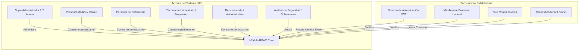
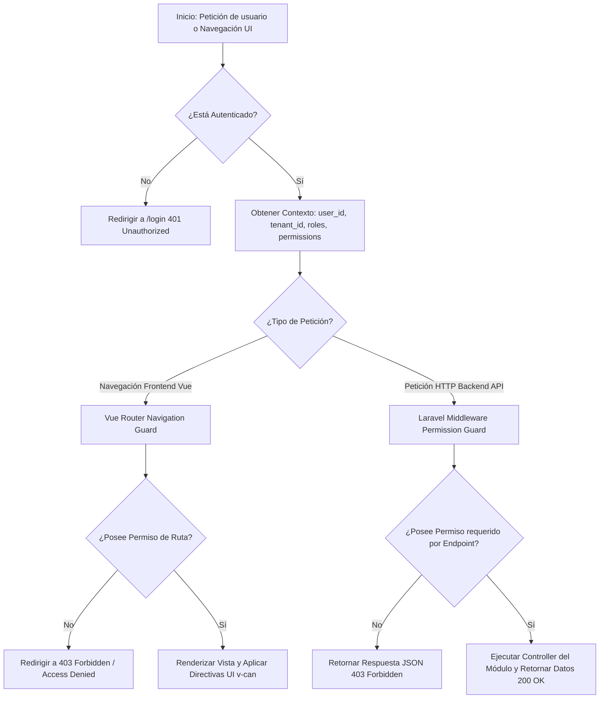
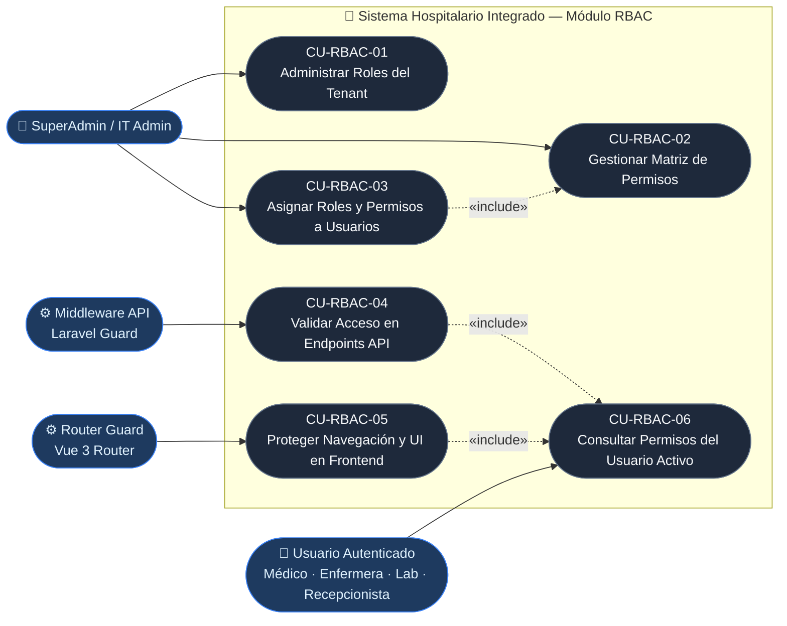

# Semana 1 — Análisis de Actores, Alcance y Casos de Uso
## Módulo 02: RBAC (Roles, Permisos y Protección de Rutas)

**Curso:** Análisis de Sistemas II (ASII) — 2026  
**Sistema:** Sistema Hospitalario Integrado (HIS)  
**Estudiante:** Luis David Aroche Contreras (`Luis890D`)  
**Rama de trabajo:** `feature/asii-02-rbac-roles-permisos-y-proteccion-de-rutas-luis890d`  
**Worktree actual:** `shi-documentacion-rbac-Luis-Aroche`  

---

## 1. Introducción al Módulo RBAC

El módulo de **Control de Acceso Basado en Roles (RBAC), Permisos y Protección de Rutas** constituye la columna vertebral del subsistema de seguridad autorizativa dentro del **Sistema Hospitalario Integrado (HIS)**. 

En un entorno hospitalario multi-tenant (donde conviven múltiples sedes o clínicas), la confidencialidad de la información médica y la segregación de funciones son requisitos críticos. Este módulo garantiza que cada usuario (médico, enfermera, laboratorista, recepcionista, administrador) tenga acceso **única y exclusivamente** a los recursos, rutas y acciones autorizadas según su rol dentro del tenant correspondiente.

---

## 2. Caracterización de Actores

Un **actor** representa un rol desempeñado por un usuario humano o un sistema externo al interactuar con el módulo RBAC.



### 2.1. Actores Principales (Usuarios Internos del Hospital)

| Actor | Categoría | Descripción y Responsabilidades en RBAC |
|---|---|---|
| **SuperAdministrador / IT Admin** | Humano (Directo) | Responsable de la creación y mantenimiento del catálogo de roles, asignación de matriz de permisos y otorgamiento/revocación de roles a usuarios dentro de la organización. |
| **Personal Médico (Médicos Especialistas / Generales)** | Humano (Consumidor) | Requiere permisos de lectura/escritura sobre expedientes (EMR), diagnósticos SOAP, prescripciones y órdenes médicas. No puede alterar la estructura de roles del sistema. |
| **Personal de Enfermería** | Humano (Consumidor) | Posee permisos para registrar signos vitales, visualizar camas y actualizar notas de evolución clínica. Sus permisos están restringidos a operativas asistenciales. |
| **Técnico de Laboratorio / Bioquímico** | Humano (Consumidor) | Acceso restringido a órdenes de laboratorio, recepción de muestras y validación de resultados. |
| **Recepcionista / Asistente Administrativo** | Humano (Consumidor) | Permisos acotados a la admisión de pacientes, búsqueda de historial demográfico y agendamiento de citas médicas. |
| **Auditor de Seguridad / Gobernanza** | Humano (Supervisor) | Acceso de solo lectura para inspeccionar la matriz de roles y permisos asignados a cada usuario (en integración con el módulo de auditoría). |

### 2.2. Actores Secundarios y Sistemas Externos

| Actor / Sistema | Tipo | Descripción de la Interacción |
|---|---|---|
| **Sistema de Autenticación JWT (`Auth Subsystem`)** | Sistema Interno | Suministra la identidad validada del usuario (`user_id`, `tenant_id`) en cada petición HTTP mediante encabezados Bearer. |
| **Middleware de Protección API (Laravel Guards)** | Sistema Interno | Intercepta las solicitudes HTTP en el backend y consulta al servicio Spatie Permission si el rol/permiso del usuario habilita la ejecución del controller. |
| **Guard de Navegación Frontend (Vue Router Guards)** | Sistema Interno | Evalúa dinámicamente antes de cada cambio de ruta (`beforeEach`) si el estado en Pinia contiene los permisos necesarios para renderizar una vista. |
| **Motor Multi-Tenant (`Stancl Tenancy`)** | Sistema Interno | Aísla los roles y permisos a nivel de base de datos por cliente/inquilino (`tenant_id`), evitando filtración cruzada de privilegios entre centros de salud. |

---

## 3. Alcance y Límites del Módulo (Boundaries)

### 3.1. Dentro del Alcance (In Scope)

1. **Gestión de Roles del Tenant (CRUD):** Creación, modificación, consulta y desactivación de roles institucionales (ej. `Admin`, `Médico`, `Enfermera`, `TecnicoLab`, `Recepcionista`).
2. **Matriz de Permisos Granulares:** Asignación y revocado de permisos específicos a roles (ej. `patients.create`, `patients.read`, `emr.soap.write`, `lab.results.validate`).
3. **Asignación de Roles a Usuarios:** Vinculación de uno o múltiples roles a usuarios dentro de su tenant activo.
4. **Protección Middleware en Backend:** Definición e implementación de middlewares de ruta (`permission:name`, `role:name`) en el router de Laravel `/api/v1/...`.
5. **Protección de Navegación en Frontend:** Implementación de `Vue Router Guards` para restringir el acceso a vistas según los permisos del usuario autenticado.
6. **Control de Interfaz de Usuario (UI Dynamic Rendering):** Directivas y compendios utilitarios (`v-can`, `hasPermission()`) para ocultar/deshabilitar botones, menús y formularios según privilegios.
7. **Exposición de Permisos en Contexto de Usuario:** Endpoint `/auth/me` y/o `/rbac/my-permissions` para retornar la lista consolidada de permisos al iniciar sesión.

### 3.2. Fuera del Alcance (Out of Scope / Dependencias Externa)

- **Autenticación primaria y login con credenciales:** Corresponde al Módulo #1 (Brandon Aquino). El módulo RBAC asume que el usuario ya se autenticó y posee un token JWT válido.
- **Bitácora de auditoría histórica detallada:** Corresponde al Módulo #22 (Boris Quiroa). RBAC genera los eventos de autorización, pero la persistencia de logs de gobernanza es responsabilidad de auditoría.
- **Lógica asistencial y de negocio de expedientes/citas/laboratorio:** Corresponde a los módulos verticales de cada especialidad. RBAC solo provee los mecanismos para denegar o autorizar el acceso.

---

## 4. Procesos Principales del Módulo RBAC



1. **Proceso 1: Definición y Mantenimiento de Roles y Permisos:** El Administrador configura la matriz de permisos para cada rol operativo del hospital.
2. **Proceso 2: Autorización Dinámica en API (Backend Guard):** Al recibir un request HTTP en un endpoint protegido, Laravel consulta la tabla de permisos del rol del usuario antes de invocar la lógica del controlador.
3. **Proceso 3: Autorización Dinámica en Frontend (Navegación y UI):** Al navegar entre vistas en Vue 3, `router.beforeEach()` valida los meta-atributos de la ruta (`meta: { permission: 'patients.read' }`). Además, la interfaz oculta componentes interactivos sin permiso.

---

## 5. Diagrama UML de Casos de Uso



---

## 6. Narrativa y Especificación Detallada de Casos de Uso

### CU-RBAC-01: Administrar Roles del Tenant

* **Identificador:** `CU-RBAC-01`
* **Nombre:** Administrar Roles del Tenant
* **Actor Principal:** SuperAdministrador / IT Admin
* **Actores Secundarios:** Motor Multi-tenant
* **Descripción:** Permite crear, consultar, actualizar y desactivar roles dentro del tenant actual (ej. `Médico Especialista`, `Enfermera Jefe`).
* **Precondiciones:**
  1. El Administrador debe estar autenticado en la plataforma.
  2. Poseer el permiso global `rbac.roles.manage`.
* **Flujo Principal:**
  1. El Administrador ingresa a la sección de "Gestión de Seguridad y Roles".
  2. El sistema solicita la lista de roles del tenant y la despliega en pantalla.
  3. El Administrador presiona "Crear Nuevo Rol", ingresa el nombre (ej. `AuditorClinico`) y una descripción.
  4. El sistema valida que el nombre del rol no esté duplicado dentro del mismo `tenant_id`.
  5. El sistema persiste el nuevo rol en la base de datos con `guard_name = 'api'`.
  6. El sistema retorna la confirmación de creación.
* **Flujos Alternativos / Excepciones:**
  * *4a. Nombre de Rol duplicado en el Tenant:* El sistema muestra un mensaje de error validation `422 Unprocessable Entity` notificando que el rol ya existe.
  * *1a. Intento de acceso sin permiso:* El middleware retorna `403 Forbidden` y el frontend muestra pantalla de acceso denegado.
* **Postcondiciones:** El nuevo rol queda disponible para asignarle permisos y vincularlo a usuarios del hospital.

---

### CU-RBAC-02: Gestionar Matriz de Permisos por Rol

* **Identificador:** `CU-RBAC-02`
* **Nombre:** Gestionar Matriz de Permisos por Rol
* **Actor Principal:** SuperAdministrador / IT Admin
* **Actores Secundarios:** Ninguno
* **Descripción:** Permite seleccionar un rol existente y marcar/desmarcar los permisos granulares asignados al mismo (ej. habilitar `lab.orders.create` al rol `Médico`).
* **Precondiciones:**
  1. El rol seleccionado debe existir en el tenant.
  2. El Administrador debe poseer el permiso `rbac.permissions.assign`.
* **Flujo Principal:**
  1. El Administrador selecciona un rol específico y hace clic en "Editar Permisos".
  2. El sistema recupera el catálogo completo de permisos del sistema organizados por módulos (`Pacientes`, `EMR`, `Laboratorio`, `Camas`, etc.) indicando los actualmente asignados.
  3. El Administrador marca los nuevos permisos requeridos y desmarca los obsoletos.
  4. El Administrador presiona "Guardar Cambios".
  5. El sistema sincroniza los permisos del rol mediante la tabla pivote de Spatie (`role_has_permissions`).
  6. El sistema invalida la caché de permisos de los usuarios afectados.
* **Flujos Alternativos / Excepciones:**
  * *5a. Error de integridad o fallo en BD:* Se realiza rollback de la transacción y se notifica el fallo al usuario.
* **Postcondiciones:** Los usuarios que tengan asignado dicho rol obtienen inmediatamente los nuevos privilegios en sus siguientes peticiones.

---

### CU-RBAC-03: Asignar / Revocar Roles a Usuarios

* **Identificador:** `CU-RBAC-03`
* **Nombre:** Asignar / Revocar Roles a Usuarios
* **Actor Principal:** SuperAdministrador / IT Admin
* **Actores Secundarios:** Usuario Receptor
* **Descripción:** Asigna uno o más roles a un usuario específico del tenant para otorgarle las facultades operativas correspondientes.
* **Precondiciones:**
  1. El usuario de destino debe pertenecer al mismo tenant.
  2. El Administrador cuenta con el permiso `rbac.users.assign_role`.
* **Flujo Principal:**
  1. El Administrador busca a un usuario en el listado del personal.
  2. Selecciona la opción "Gestionar Roles del Usuario".
  3. El sistema muestra los roles actuales del usuario y la lista de roles disponibles.
  4. El Administrador añade o remueve roles y guarda la configuración.
  5. El sistema actualiza la relación en la tabla `model_has_roles`.
  6. El sistema confirma la actualización.
* **Flujos Alternativos / Excepciones:**
  * *4a. Intento de remover el único Administrador del Tenant:* El sistema bloquea la acción exigiendo que exista al menos un usuario con rol `Admin` activo.
* **Postcondiciones:** Las credenciales y permisos calculados del usuario cambian inmediatamente en la sesión activa.

---

### CU-RBAC-04: Validar Acceso en Endpoints API (Backend Middleware Guard)

* **Identificador:** `CU-RBAC-04`
* **Nombre:** Validar Acceso en Endpoints API
* **Actor Principal:** Middleware API (Laravel Spatie Guard)
* **Actores Secundarios:** Usuario Autenticado
* **Descripción:** Intercepta cada solicitud HTTP entrante a las rutas protegidas de la API y verifica si el usuario posee la combinación de rol/permiso exigida por la ruta.
* **Precondiciones:**
  1. La ruta API declarada en `routes/api.php` contiene la directiva middleware (ej. `middleware(['auth:api', 'permission:patients.create'])`).
* **Flujo Principal:**
  1. Llega una petición HTTP (ej. `POST /api/v1/patients`) con encabezado `Authorization: Bearer <token>`.
  2. El middleware de autenticación valida el token JWT y resuelve el usuario autenticado.
  3. El middleware `PermissionMiddleware` verifica si el usuario cuenta con el permiso `patients.create` a través de sus roles asignados.
  4. Si la verificación es exitosa, la petición continúa hacia el controlador (`PatientController@store`).
* **Flujos Alternativos / Excepciones:**
  * *3a. El usuario no posee el permiso requerido:* El middleware interrumpe el procesamiento y retorna inmediatamente una respuesta JSON con código `403 Forbidden` y el mensaje `"User does not have the right permissions."`.
* **Postcondiciones:** Se impide la ejecución no autorizada de controladores y mutación de datos de negocio.

---

### CU-RBAC-05: Proteger Navegación y UI en Frontend (Vue 3 Router & UI Guards)

* **Identificador:** `CU-RBAC-05`
* **Nombre:** Proteger Navegación y UI en Frontend
* **Actor Principal:** Guard de Navegación Frontend (`Vue Router`)
* **Actores Secundarios:** Usuario de la aplicación SPA
* **Descripción:** Impide la entrada a vistas protegidas mediante la URL del navegador si el usuario carece de permisos, y oculta dinámicamente elementos visuales (botones, menús).
* **Precondiciones:**
  1. Las rutas del frontend en `router/index.js` están etiquetadas con metadatos de permisos (ej. `meta: { requiresAuth: true, permission: 'lab.results.write' }`).
* **Flujo Principal:**
  1. El usuario intenta navegar a la ruta `/laboratorio/resultados`.
  2. El guard global `router.beforeEach()` intercepta el cambio de vista.
  3. Consulta la tienda de Pinia (`useAuthStore`) para verificar el arreglo de permisos del usuario activo.
  4. Si el permiso `lab.results.write` está presente, concede el paso y carga la vista.
  5. En el renderizado del componente Vue, las directivas `v-can="'lab.results.validate'"` muestran u ocultan los botones de aprobación según corresponda.
* **Flujos Alternativos / Excepciones:**
  * *4a. El usuario no tiene el permiso de ruta:* El guard cancela la navegación y redirige a la vista `/403` o muestra una notificación emergente de acceso restringido.
* **Postcondiciones:** La interfaz se adapta dinámicamente al perfil autorizativo del usuario, ofreciendo una experiencia segura y limpia.

---

### CU-RBAC-06: Consultar Permisos del Usuario Activo

* **Identificador:** `CU-RBAC-06`
* **Nombre:** Consultar Permisos del Usuario Activo
* **Actor Principal:** Usuario Autenticado
* **Actores Secundarios:** Frontend SPA (Pinia Auth Store)
* **Descripción:** Endpoint y mecanismo mediante el cual el frontend obtiene la lista unificada de roles y permisos otorgados al usuario al autenticarse o refrescar perfil.
* **Precondiciones:**
  1. Token JWT válido enviado en la cabecera.
* **Flujo Principal:**
  1. El frontend realiza una petición `GET /api/v1/auth/me` (o `/api/v1/rbac/my-permissions`).
  2. El backend identifica al usuario y consulta sus roles y permisos resueltos (heredados y directos).
  3. Retorna un objeto JSON estructurado:
     ```json
     {
       "id": 15,
       "name": "Dr. Carlos Mendoza",
       "tenant_id": "tenant-01",
       "roles": ["Médico"],
       "permissions": [
         "patients.read",
         "patients.create",
         "emr.soap.write",
         "prescriptions.create"
       ]
     }
     ```
  4. El frontend almacena dichos permisos en el estado global (Pinia) para reactividad inmediata.
* **Flujos Alternativos / Excepciones:**
  * *1a. Token inválido o expirado:* Retorna `401 Unauthorized`.
* **Postcondiciones:** El cliente web dispone del contexto completo de autorización para gobernar las pantallas y acciones.

---

## 7. Criterios de Aceptación y Trazabilidad para la Semana 1

| Requisito / Entregable | Criterio de Aceptación | Estado |
|---|---|:---:|
| **Identificación de Actores** | Actores primarios, secundarios y subsistemas mapeados y caracterizados con su rol específico en el HIS. |  Completado |
| **Alcance y Límites** | Delimitación clara entre lo que incluye RBAC y lo que depende de otros módulos (Auth, Auditoría, Módulos clínicos). |  Completado |
| **Procesos Clave** | Definición del flujo autorizativo tanto en backend (Laravel) como en frontend (Vue 3). |  Completado |
| **Diagrama UML de Casos de Uso** | Diagrama ejecutable en Mermaid con actores, frontera de sistema y relaciones de casos de uso. |  Completado |
| **Narrativa de Casos de Uso** | 6 Casos de Uso estructurados en formato estándar (CU-RBAC-01 a 06) con flujos principal y alternativo. |  Completado |

---

## 8. Conclusiones y Próximos Pasos (Semana 2)

Con la culminación del entregable de la **Semana 1**, el Módulo 02 RBAC cuenta con su frontera de sistema claramente definida y modelada en UML. 

Para la **Semana 2**, se procederá a:
- Matriz detallada de Requerimientos Funcionales (RF) y No Funcionales (RNF).
- Criterios de Aceptación probables por cada RF.
- Ejemplo de aplicación del principio **SOLID** (usando como referencia Single Responsibility u Open/Closed) en el diseño de middlewares o servicios autorizativos.
