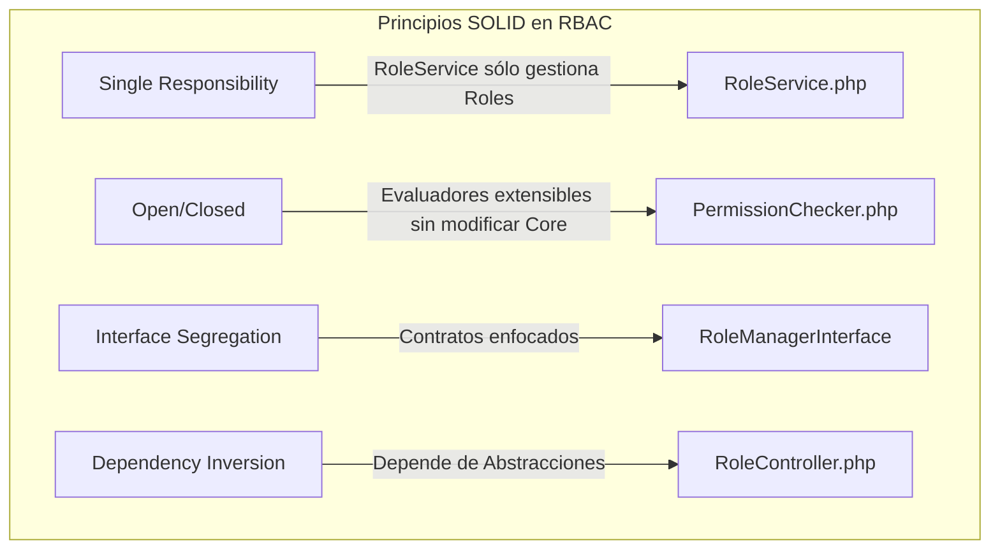

# Semana 2 — Requerimientos Funcionales, No Funcionales, Criterios de Aceptación y Principios SOLID
## Módulo 02: RBAC (Roles, Permisos y Protección de Rutas)

**Curso:** Análisis de Sistemas II (ASII) — 2026  
**Sistema:** Sistema Hospitalario Integrado (HIS)  
**Estudiante:** Luis David Aroche Contreras (`Luis890D`)  
**Rama de trabajo:** `feature/asii-02-rbac-roles-permisos-y-proteccion-de-rutas-luis890d`  
**Worktree actual:** `shi-documentacion-rbac-Luis-Aroche`  
**Fuente de Referencia SOLID:** [MVP Cluster — Diseño de Software 2](https://mvpcluster.com/diseno-de-software-2/)

---

## 1. Requerimientos Funcionales (RF)

Los **Requerimientos Funcionales** definen los comportamientos específicos, operaciones y servicios que el módulo RBAC debe proveer dentro del Sistema Hospitalario Integrado.

| Código | Requerimiento Funcional | Descripción Detallada | Prioridad | Módulo / Caso de Uso Relacionado |
|---|---|---|:---:|:---:|
| **RF-RBAC-01** | **Gestión del Catálogo de Roles del Tenant** | El sistema debe permitir al SuperAdministrador crear, consultar, modificar y desactivar roles institucionales (ej. `Admin`, `Médico`, `Enfermera`, `TecnicoLab`, `Recepcionista`) dentro del ámbito de su tenant. | **Alta** | `CU-RBAC-01` |
| **RF-RBAC-02** | **Matriz de Asignación de Permisos a Roles** | El sistema debe permitir asociar y disociar permisos granulares del sistema (ej. `patients.create`, `emr.soap.write`, `lab.results.validate`) a roles específicos mediante una interfaz visual tipo matriz de checkboxes. | **Alta** | `CU-RBAC-02` |
| **RF-RBAC-03** | **Asignación y Revocación de Roles a Usuarios** | El sistema debe permitir asignar uno o múltiples roles a los usuarios registrados dentro del tenant, actualizando inmediatamente sus privilegios efectivos. | **Alta** | `CU-RBAC-03` |
| **RF-RBAC-04** | **Protección Middleware en Rutas API Backend** | El backend (Laravel) debe interceptar todas las peticiones HTTP a rutas protegidas bajo `/api/v1/` y denegar el acceso (`403 Forbidden`) si el usuario no posee el rol o permiso requerido. | **Crítica** | `CU-RBAC-04` |
| **RF-RBAC-05** | **Guards de Navegación y UI Dinámica en Frontend** | El frontend (Vue 3) debe impedir el acceso a vistas mediante `Vue Router Guards` (`beforeEach`) y ocultar/deshabilitar elementos de la interfaz (botones, formularios, opciones de menú) usando la directiva `v-can`. | **Alta** | `CU-RBAC-05` |
| **RF-RBAC-06** | **Consulta de Permisos del Usuario Autenticado** | El sistema debe proveer un endpoint (`GET /api/v1/auth/me` o `/api/v1/rbac/my-permissions`) que retorne la lista consolidada de roles y permisos del usuario activo para hidratar la tienda Pinia. | **Crítica** | `CU-RBAC-06` |
| **RF-RBAC-07** | **Invalidación y Sincronización Automática de Caché** | Al modificar la matriz de permisos de un rol o reasignar un rol a un usuario, el sistema debe limpiar la caché de permisos (`Spatie Permission Cache`) para aplicar los cambios sin reiniciar el servidor. | **Media** | `CU-RBAC-02`, `CU-RBAC-03` |

---

## 2. Requerimientos No Funcionales (RNF)

Los **Requerimientos No Funcionales** establecen los atributos de calidad, restricciones técnicas y criterios de rendimiento del módulo RBAC.

| Código | Requerimiento No Funcional | Descripción y Métricas Objetivo | Categoría |
|---|---|---|:---:|
| **RNF-RBAC-01** | **Aislamiento Estricto por Tenant (Multi-Tenancy)** | Ningún usuario de un tenant (ej. Hospital A) podrá visualizar o heredar roles/permisos pertenecientes a otro tenant (ej. Clínica B). Todos los queries de RBAC deben incluir `tenant_id`. | **Seguridad** |
| **RNF-RBAC-02** | **Rendimiento y Latencia de Autorización** | La evaluación de permisos en el Middleware de Laravel no debe agregar más de **15 ms** a la latencia total del request. Se debe hacer uso de caché en Redis/Memcached/File. | **Rendimiento** |
| **RNF-RBAC-03** | **Mantenibilidad y Modularidad (SOLID)** | El código debe respetar una arquitectura limpia en capas (Controller -> Service -> Repository / Spatie Models), facilitando la adición de nuevos permisos sin alterar controladores estables. | **Arquitectura** |
| **RNF-RBAC-04** | **Usabilidad y Accesibilidad en UI** | La matriz de administración de permisos debe permitir filtrado por módulo, selección masiva ("Seleccionar todos") y retroalimentación clara de guardado en menos de 2 clics. | **Usabilidad** |
| **RNF-RBAC-05** | **Disponibilidad y Tolerancia a Fallos** | Si el servicio de validación de permisos falla o la caché se corrompe, el sistema debe fallar de manera segura (*Fail-Closed*), denegando por defecto antes que permitir acceso no autorizado. | **Fiabilidad** |

---

## 3. Criterios de Aceptación (Gherkin BDD / Checklist)

### 3.1. Criterios de Aceptación para RF-RBAC-01: Creación de Roles
* **Escenario 1: Creación exitosa de un nuevo rol en el tenant**
  * **Dado** que un Administrador autenticado tiene el permiso `rbac.roles.manage` en el Tenant "Hospital Central",
  * **Cuando** envía una solicitud `POST /api/v1/rbac/roles` con el payload `{"name": "CirujanoJefe", "description": "Líder de área quirúrgica"}`,
  * **Entonces** el sistema responde con HTTP status `201 Created`, registra el rol vinculado al `tenant_id` activo y retorna el objeto del rol creado.

* **Escenario 2: Intento de crear un rol duplicado**
  * **Dado** que el rol `Médico` ya existe en el tenant activo,
  * **Cuando** el Administrador intenta crear un rol con el mismo nombre `Médico`,
  * **Entonces** el sistema responde con HTTP status `422 Unprocessable Entity` y el mensaje `"El nombre del rol ya está registrado para este hospital"`.

---

### 3.2. Criterios de Aceptación para RF-RBAC-04: Protección de API Middleware
* **Escenario 1: Acceso concedido a endpoint protegido**
  * **Dado** que un usuario con rol `Enfermera` posee el permiso `vital_signs.create`,
  * **Cuando** realiza una solicitud `POST /api/v1/vital-signs` adjuntando un token JWT válido,
  * **Entonces** el Middleware autoriza la solicitud y el controlador procesa la creación retornando `201 Created`.

* **Escenario 2: Acceso denegado (403 Forbidden)**
  * **Dado** que un usuario con rol `Recepcionista` **no** posee el permiso `emr.soap.write`,
  * **Cuando** intenta realizar una solicitud `POST /api/v1/emr/soap-notes`,
  * **Entonces** el Middleware detiene la ejecución, evita la llamada al controlador y retorna una respuesta JSON `403 Forbidden` con `{"error": "Acceso denegado. No posee el permiso emr.soap.write"}`.

---

### 3.3. Criterios de Aceptación para RF-RBAC-05: Protecciones Frontend Vue 3
* **Escenario 1: Redirección automática de navegación sin permiso**
  * **Dado** que el usuario actual solo tiene el rol `TecnicoLab`,
  * **Cuando** intenta ingresar manualmente a la URL `/admin/roles` en el navegador,
  * **Entonces** el `Vue Router Guard` detecta la falta del permiso `rbac.roles.manage`, cancela la navegación y redirige al usuario a `/403-forbidden`.

* **Escenario 2: Ocultamiento dinámico de botones mediante directiva `v-can`**
  * **Dado** que la vista de expediente médico evalúa la directiva `v-can="'emr.soap.delete'"`,
  * **Cuando** el usuario en sesión es un `Médico General` (que solo tiene permiso de lectura y creación),
  * **Entonces** el botón "Eliminar Nota SOAP" no se renderiza en el DOM de la página.

---

## 4. Ejemplos Prácticos de Principios SOLID Aplicados al Módulo RBAC

De acuerdo con la fuente oficial del curso ([MVP Cluster — Diseño de Software 2](https://mvpcluster.com/diseno-de-software-2/)), la aplicación de principios de diseño orientado a objetos garantiza software mantenible, desacoplado y fácil de probar.



---

### 4.1. Single Responsibility Principle (SRP) — Principio de Responsabilidad Única
> *"Cada clase, componente o servicio debe tener una sola responsabilidad concreta y una única razón para cambiar."*

#### Mala Práctica (Violación de SRP):
Un `RoleController` que procesa la petición HTTP, valida los datos, ejecuta la lógica de base de datos, limpia la caché de Spatie y formatea la respuesta en un solo lugar.

#### Buena Práctica (Aplicando SRP):
Separamos la responsabilidad de la lógica de negocio autorizativa en un servicio dedicado `RoleManagementService`, dejando al controlador únicamente la tarea de orquestar la entrada y salida HTTP.

```php
<?php

namespace App\Services\RBAC;

use Spatie\Permission\Models\Role;
use Illuminate\Support\Facades\Cache;

/**
 * Clase responsable ÚNICAMENTE de la lógica de negocio y persistencia de Roles.
 */
class RoleManagementService
{
    public function createRole(string $name, array $permissionIds, string $tenantId): Role
    {
        $role = Role::create([
            'name' => $name,
            'guard_name' => 'api',
            'tenant_id' => $tenantId,
        ]);

        if (!empty($permissionIds)) {
            $role->syncPermissions($permissionIds);
        }

        // Limpieza explícita de la caché de permisos
        app(\Spatie\Permission\PermissionRegistrar::class)->forgetCachedPermissions();

        return $role;
    }
}
```

---

### 4.2. Open/Closed Principle (OCP) — Principio de Abierto/Cerrado
> *"Las entidades de software deben estar abiertas para la extensión, pero cerradas para la modificación."*

#### Aplicación en RBAC:
El motor de evaluación de permisos debe permitir agregar nuevas reglas de autorización (ej. evaluación por roles, evaluación por atributo temporal, evaluación por contexto de emergencia) sin modificar la clase evaluadora principal `AuthorizationEngine`.

```php
<?php

namespace App\Services\RBAC\Contracts;

use App\Models\User;

interface PermissionEvaluatorInterface
{
    public function evaluate(User $user, string $permission): bool;
}

// Estrategia 1: Evaluación Estándar por Spatie RBAC
class StandardRoleEvaluator implements PermissionEvaluatorInterface
{
    public function evaluate(User $user, string $permission): bool
    {
        return $user->hasPermissionTo($permission, 'api');
    }
}

// Estrategia 2: Extensión sin modificar el código original (Atención de Emergencia)
class EmergencyOverrideEvaluator implements PermissionEvaluatorInterface
{
    public function evaluate(User $user, string $permission): bool
    {
        if ($user->isInEmergencyMode() && str_starts_with($permission, 'emr.')) {
            return true; // Garantiza acceso vital durante emergencias sanitarias
        }

        return $user->hasPermissionTo($permission, 'api');
    }
}
```

---

### 4.3. Interface Segregation Principle (ISP) — Principio de Segregación de Interfaces
> *"Ninguna clase debe verse forzada a depender de métodos que no utiliza."*

#### Aplicación en RBAC:
En lugar de crear una interfaz monolítica `IBigRbacManager` con 30 métodos para roles, permisos, usuarios y tenants, creamos contratos pequeños y enfocados.

```php
<?php

namespace App\Services\RBAC\Contracts;

interface RoleReaderInterface
{
    public function getRoleByName(string $name): ?object;
    public function listRolesByTenant(string $tenantId): array;
}

interface PermissionAssignerInterface
{
    public function syncPermissionsToRole(int $roleId, array $permissionNames): void;
}
```

---

### 4.4. Dependency Inversion Principle (DIP) — Principio de Inversión de Dependencias
> *"Los módulos de alto nivel no deben depender de módulos de bajo nivel; ambos deben depender de abstracciones."*

#### Aplicación en RBAC (Laravel Controller):
El `RoleController` (alto nivel) no instancia ni depende directamente del servicio concreto de base de datos, sino de la abstracción `RoleReaderInterface` o la inyección de servicios por contenedor IoC de Laravel.

```php
<?php

namespace App\Http\Controllers\Api\V1;

use App\Http\Controllers\Controller;
use App\Services\RBAC\Contracts\RoleReaderInterface;
use Illuminate\Http\JsonResponse;

class RoleController extends Controller
{
    public function __construct(
        private readonly RoleReaderInterface $roleReader
    ) {}

    public function index(): JsonResponse
    {
        $tenantId = request()->header('X-Tenant-ID');
        $roles = $this->roleReader->listRolesByTenant($tenantId);

        return response()->json([
            'status' => 'success',
            'data' => $roles
        ]);
    }
}
```

---

## 5. Resumen de Entregables y Trazabilidad (Semana 2)

| Requisito / Entregable | Criterio de Cumplimiento | Estado |
|---|---|:---:|
| **Requerimientos Funcionales (RF)** | 7 RFs definidos con código, descripción, prioridad y caso de uso asociado. |  Completado |
| **Requerimientos No Funcionales (RNF)** | 5 RNFs definidos en categorías de Seguridad, Rendimiento, Mantenibilidad, Usabilidad y Fiabilidad. |  Completado |
| **Criterios de Aceptación** | Escenarios BDD en formato *Given/When/Then* para creación de roles, middleware API y guards UI. |  Completado |
| **Ejemplo Principios SOLID** | 4 principios (SRP, OCP, ISP, DIP) explicados y ejemplificados con código PHP/Laravel orientado a RBAC. |  Completado |

---

## 6. Próximos Pasos (Semana 3)

Para la **Semana 3**, se avanzará con:
- **Diseño Arquitectónico del Módulo RBAC.**
- **Diagrama de Vistas Arquitectónicas (C4 Model / UML Componentes).**
- **Definición de dependencias e integraciones con los subsistemas del HIS.**
